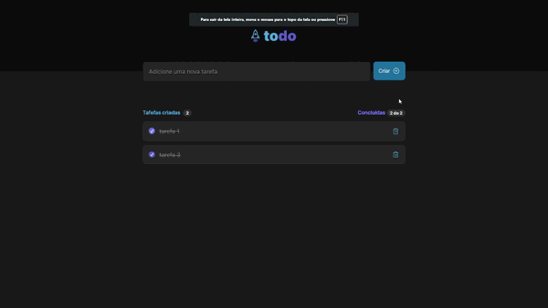

 <h1 align="center">Todo app - Desafio da trilha React do curso Ignite da Rocketseat</h1>

---

 

## 🚀 Sobre o desafio

 

Este desafio consistiu em desenvolver uma aplicação de controle de tarefas no estilo **to-do list**, que contém as seguintes funcionalidades:

- Adicionar uma nova tarefa
- Marcar e desmarcar uma tarefa como concluída
- Remover uma tarefa da listagem
- Mostrar o progresso de conclusão das tarefas

 

## Funcionalidades extras adicionadas

- Responsividade
- Componetização
- Context API
- useReducer
- Drag-and-Drop
- React-toastfy
- UUID

 

Desenvolvido por:
 

Matheus Pedroso 👋 [Linkedin](https://www.linkedin.com/in/matheuspedrosoo/)
 

